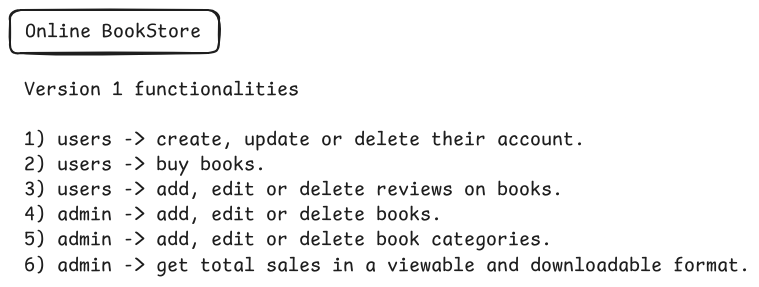
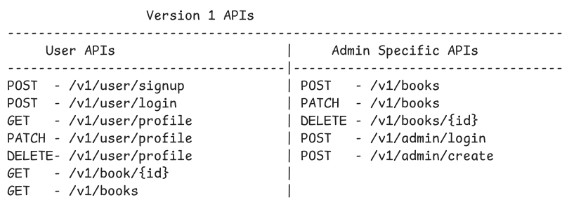
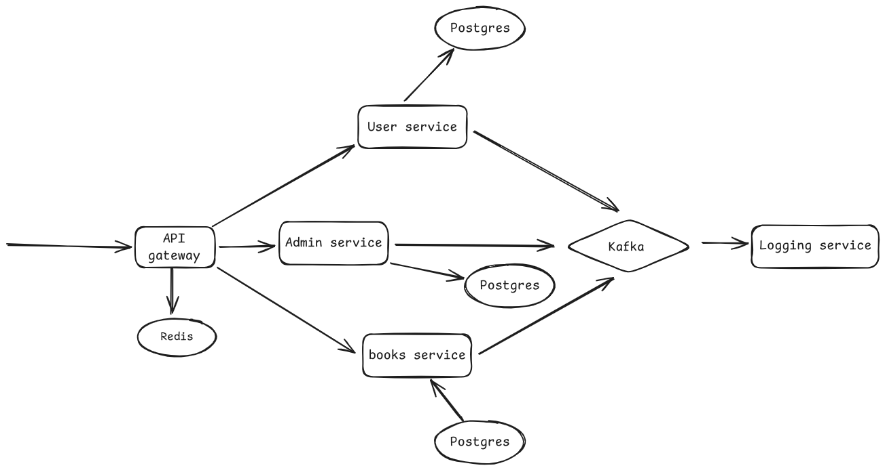

### Book Store Using Microservice Architecture

### Initial Functionalities



### APIs for version 1



## Run Using Docker

0. Make sure you have docker installed in your system.
   <br>
   Click [docker installation](https://docs.docker.com/engine/install/) incase you dont have docker.

1. Clone the repository

```bash
git clone https://github.com/Surya-7890/microservices_practice_1.git
```

2. To run the application, run the following command

```bash
make dev
```

3. Make sure to clear all the containers after usage.
   This removes all the containers, created by the compose file

```bash
make stop
```

4. You can clear all the volumes, using the following command

```bash
make clean
```

### Architecture


